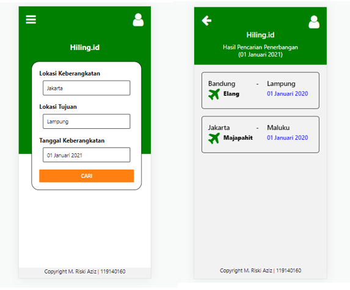
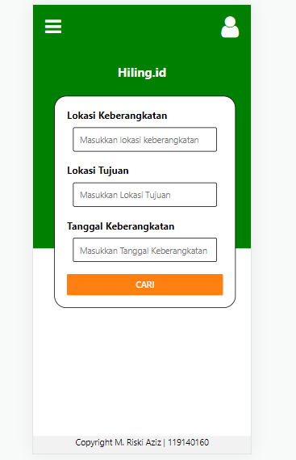
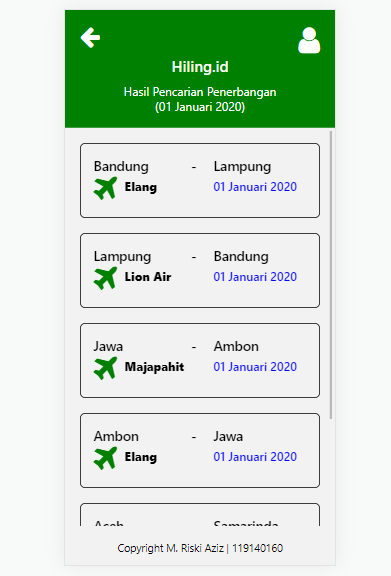

# Tugas Individu 3 PAM

## Instalasi

1.  Dengan File APK  
    dapat diinstal dengan mendownload file apk yang tertera pada folder file_apk,  
    kemudian menginstalnya pada android anda  
2.  Dengan React Native  
    • Instal terlebih dahulu node.js versi 12 atau lebih (Jika sudah memiliki, skip bagian ini)  
    • Download semua file pada folder project  
    • Gunakan terminal lalu lakukan perintah berikut  
    -> cd ReactNative  
    -> npm start  

## Deskripsi Aplikasi

• Aplikasi terdiri dari dua halaman yaitu Home dan Hasil Pencarian  
• Home digunakan untuk mengisikan jadwal penerbangan apa yang ingin di cari,  
dengan memasukkan inputan lokasi keberangkatan, lokasi tujuan dan tanggal penerbangan  
• Hasil Pencarian untuk menampilkan penerbangan yang sesuai dengan inputan yang dimasukkan,  
pada halaman ini semua data yang mirip dengan inputan akan di tampilkan  

## Cara Kerja

1.  Tampilan Awal Akan terlihat seperti pada gambar berikut ini :
      
    Kita dapat isikan input tersebut sesuai dengan data yang ingin kita cari,  
    Setelah itu kita klik tombol cari, maka akan di arahkan ke halaman Hasil Pencarian  

2.  Tampilan Hasil Pencarian Akan terlihat seperti pada gambar berikut ini :
      
    Pada halaman ini akan menampilkan data-data penerbangan sesuai dengan data yang diinputkan

## Pembuatan Aplikasi

1. Langkah awal kita pecah halaman kedalam 3 file yaitu App.js, Home.js dan hasilPencarian.js  
   App.js => secara garis besar akan berisikan navigator untuk berpindah antara halaman home.js dan hasilPencarian.js  
   Home.js => secara garis besar akan berisikan halaman home yang berisikan 3 text input dan 1 button  
   hasilPencarian.js => secara garis besar akan berisikan halaman yang menampilkan data sesuai dengan inputan yang diberikan  

2. Lakukan pembuatan navigator pada app.js dalam hal ini akan digunakan stackNavigator  

3. Bentuk halaman home sesuai keriterian tugas  
   kemudian tambahkan props untuk dapat membaca dan mengirim inputan pada text input  

4. Bentuk halaman hasilPencarian sesuai dengan keriterian tugas  
   Pastikan props yang dikirim dapat diterima halaman ini  
   Lakukan pengecekan menggunakan if, data yang sesuai dengan inputan, lalu tampilkan data tersebut  

## Sumber

1. https://reactnative.dev/
2. https://reactnavigation.org/
3. https://fontawesome.com/v5/docs/web/use-with/react-native
4. PPT Perkuliahan Pemrograman Aplikasi Mobile 2022
